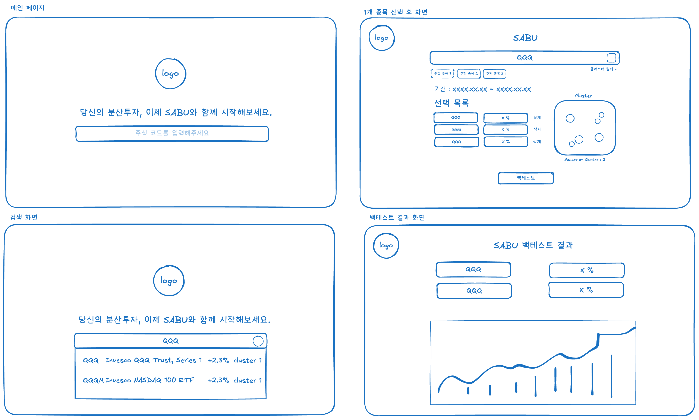
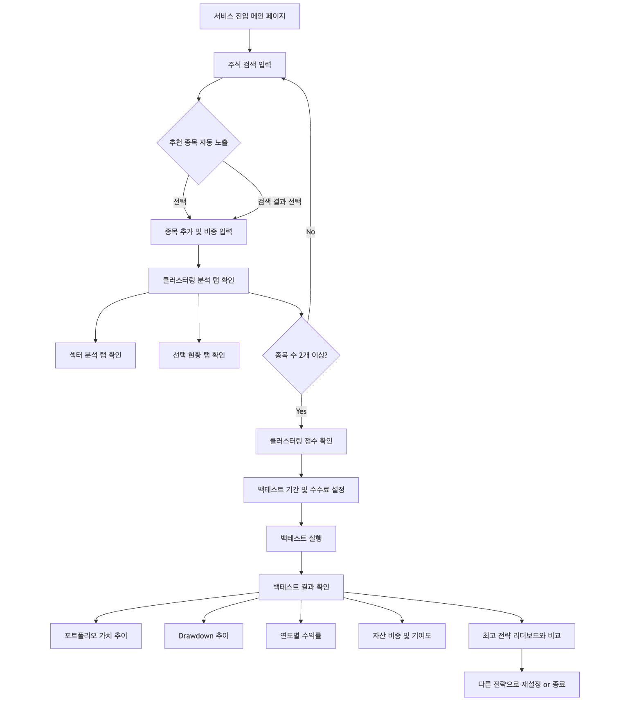

# 🧭 UI 디자인 문서

## 개요
이 문서는 전체 화면의 흐름과 레이아웃 구조를 설명하기 위해 작성되었습니다.  
와이어프레임 이미지, 페이지 전환 흐름, 사용자 인터랙션 등을 포함합니다.

## 1. 전체 와이어프레임 및 UI 스케치

> `./wireframes/main-ui.png`

> `./wireframes/첫 화면.png

> `./wireframes/검색 중 화면.png

> `./wireframes/1개 선택 이후 화면.png

> `./wireframes/백테스트 결과.png

## 2. 주요 화면 소개

### 2-1. 메인 페이지

- **기능**: 사용자 최초 진입 시 노출되는 랜딩 화면으로, 브랜드 슬로건과 함께 최고 수익률을 기록한 전략들을 보여주는 대시보드입니다.
- **주요 컴포넌트**: `Logo`, `SearchBox`, `LeaderboardTicker`

---

### 2-2. 검색 화면

- **기능**: 사용자가 주식 티커, 이름, 섹터 등을 키워드로 검색할 수 있는 인터페이스입니다.
- **특징**:
  - 실시간 자동완성
  - 섹터 및 클러스터 정보, 등락률, 현재가 포함

---

### 2-3. 종목 추천

- **기능**: 선택된 종목들의 조합을 바탕으로 SABU 알고리즘이 자동 추천 종목을 제시합니다.
- **특징**: 추천 종목은 기존 검색 결과와 구분되어 우선 노출됩니다.

---

### 2-4. 클러스터 필터링 검색

- **기능**: 사용자가 관심 있는 클러스터만 선택해 해당 클러스터의 종목만 검색할 수 있도록 지원합니다.
- **컴포넌트**: `ClusterFilter`, `SearchBox`

---

### 2-5. 주식 메타 정보

- **기능**: 선택한 주식의 가격 그래프(일/주/월/연 단위), 기업 정보, 뉴스 및 뉴스 감성 분석 등을 확인할 수 있습니다.
- **구성**:
  - 가격 그래프 탭
  - 뉴스 탭
  - 메타 정보 탭

---

### 2-6. 자체 클러스터링 시각화

- **기능**: 사용자가 선택한 종목들이 어떤 클러스터에 속해있는지 시각적으로 확인할 수 있습니다.
- **구현 방식**: Convex Hull 기반 다각형 외곽선 시각화 + Bubble chart
- **컴포넌트**: `ClusterChart`, `StockTable`

---

### 2-7. 섹터 별 클러스터링 시각화

- **기능**: 각 산업 섹터의 대표성이 PCA 기반으로 시각화되어 섹터 간 유사도를 한눈에 확인할 수 있습니다.
- **컴포넌트**: `SectorScatterChart`

---

### 2-8. 섹터 별 선택 시각화

- **기능**: 현재 선택된 종목이 어떤 섹터에 포함되어 있는지를 히트맵 형태로 시각화하여 선택 편중 여부를 시각적으로 제공합니다.
- **컴포넌트**: `SectorHeatmap`

---

### 2-9. 백테스팅 날짜 선택

- **기능**: 백테스트 시작/종료 월 선택 기능
- **컴포넌트**: `MonthPicker`
- **기타**: 수수료 비율 입력란 포함

---

### 2-10. 백테스팅 설정 창

- **기능**: 선택 종목과 비중을 설정한 후, 날짜 및 수수료 정보를 기반으로 백테스트 실행을 요청합니다.
- **구성 요소**:
  - 종목 리스트 (`StockTable`)
  - 클러스터링 결과 (`ClusterChart`)
  - 설정 입력창

---

### 2-11. 백테스팅 결과 1

- **기능**: 전략별 총 수익률, CAGR, 최대 낙폭(MDD), 자산 최종 가치 등을 한눈에 보여줍니다.
- **컴포넌트**: `BacktestDashboard`의 통계 카드 영역 (`StatCard`)

---

### 2-12. 백테스팅 결과 2

- **기능**: 전략별 포트폴리오 가치 변화 및 Drawdown 곡선을 시각화합니다.
- **차트 구성**:
  - Line chart: 자산 변화
  - Line chart: Drawdown

---

### 2-13. 백테스팅 결과 3

- **기능**:
  - 연도별 수익률 Bar 차트
  - 자산 비중 Pie 차트
  - 자산 기여도 테이블
- **주요 컴포넌트**: `BacktestDashboard` 내부의 연도별/자산별 시각화

---

## 3. 사용자 플로우

